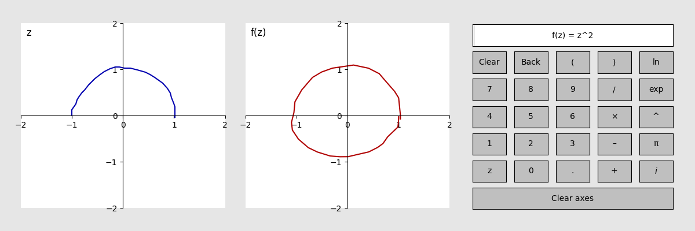
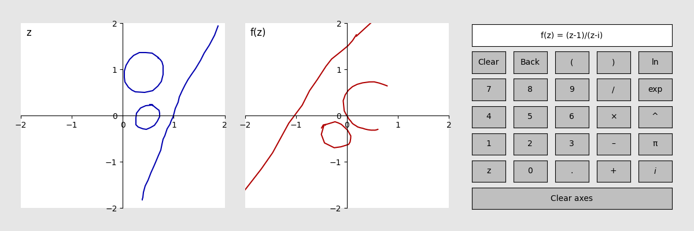

# Complex mapping

This tool takes user-drawn curves from one copy of the complex plane and maps them to another.
Click and hold with the left mouse button to draw curves in the complex plane on the left.
They will be mapped by a function you define into the complex plane on the right.
You can zoom in and out with the scroll wheel.
Use the calculator buttons on the right to define your own complex map!

